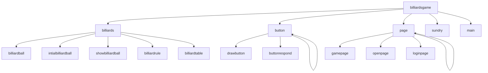

# 台球游戏

## 打开工程文件

双击**billiardsgame.sln - 快捷方式**

## 运行程序

**1.**打开工程文件，生产exe文件

**2.**双击运行**billiardsgame.exe快捷方式

## 玩法介绍

**注册功能：**点击Register按钮可以注册自己的账号，存档读档与其他账号独立。账号为四位数字，密码为9位以内字符。

**游客登录**：不注册也可直接进入游戏，此时所用账号实际上是0000，游客共用这个账号。

**账号登录：**如果已经注册过账号，可以输入账号密码登录。已有一个初始账户和密码，账户：0001，密码：1111；

**账号注销：**在游戏界面，点击OPTION按钮，打开菜单界面后，点击settting按钮进入设置页面，在此页面点击Close Account即可删除此账号。在设置页面点击Change Account也可切换账号。

**游戏模式选择：**先点击SNOOKER，SIDE_POCKET，AMERICAN，ENTERTAIN等按钮选择游戏模式，再按NEWGAME或者LOADGAME即可进行新游戏或者读档，没有档时LOADGAME也进入新游戏。

● SNOOKER：必须红球彩球交替进洞，红球进洞加一分，彩球进洞按照不同颜色加分。如果不按顺序，使红球进洞 则-4，彩球进洞，依据彩球分数扣分。红球没有完全进洞之前，彩球进洞都需复位。

● SIDE_POCKET ：每人一轮击球，需要按照数字从小到大击球，有三次击球机会，三次内必须把最小数字的球击进洞， 进洞后，三次机会重置。如果失败，球复位，轮到下一个玩家进行。

● AMERICAN： P1,P2交替击球，必须由小到大击球，最先击打完自己球的人获胜，错误击球则球重置。

● ENTERTAIN**：**P1,P2交替击球，任意击球，球进洞可继续击球，不同球对应分值不同，最终分高者胜出。

**撤销：**在游戏页面也可点击Regret按钮撤销上一步操作，缓存仅当点击鼠标后方才存档。

**菜单：**从游戏进入MENU页面后，游戏进入**暂停状态**，可以点击**Continue按钮**继续游戏；点击**Restart按钮**，重新开始游戏；点击**sava按钮**存档；**Load按钮**读档：点击**设置按钮**进入设置页面：点击**Return to HOME**回到主页面：**EXIT按钮**退出游戏。

**设置：**可以对音量设置，音效有无，辅助线条有无，模式选择，鼠标灵敏度进行调整，摩擦阻尼大小调整，击球力度大小调整。也可切换账号，删除账户。

 

##文件夹介绍

**1.lib** ：存储图形库文件

**2.billiardsgame**：存储工程文件，以及资源文件，其中用户账户信息存billiardsgame\billiardsgame\data\account中；播放的音乐存于billiardsgame\billiardsgame\data\music中

**3.src**：存放自己编写的代码文件，下属五个子文件

## 作者介绍

​	**吕蓝翔，李逸东**